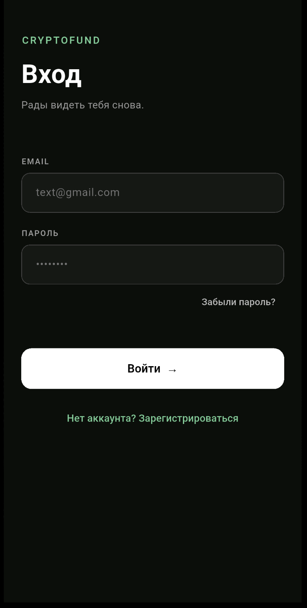
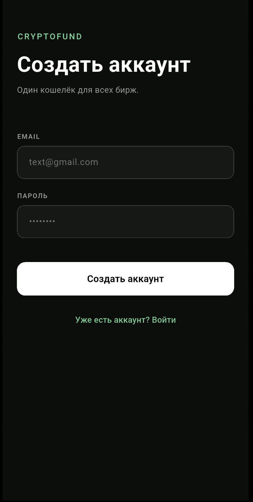
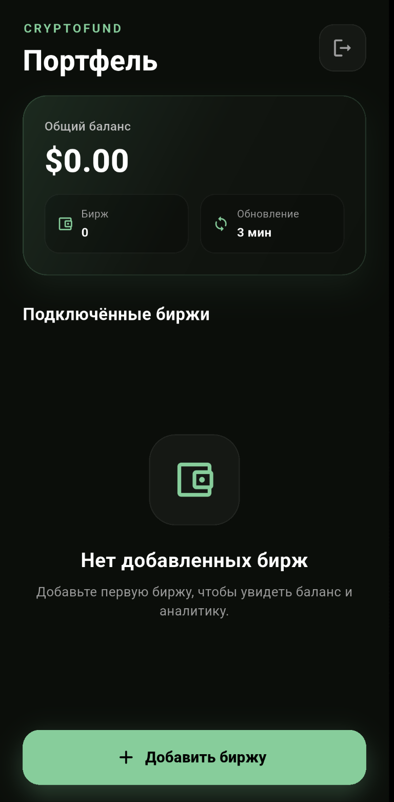
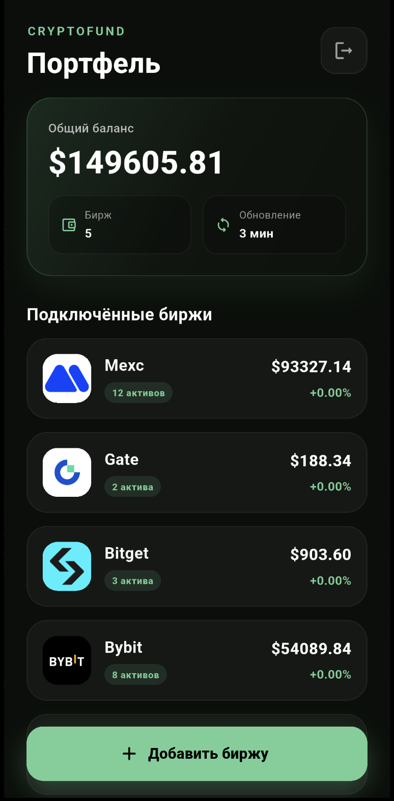
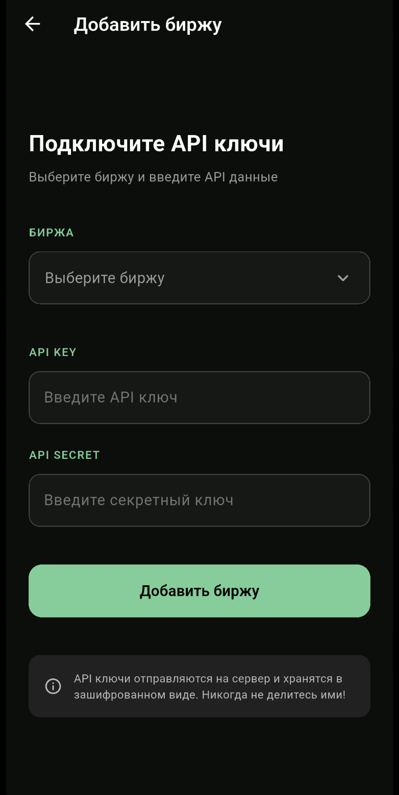
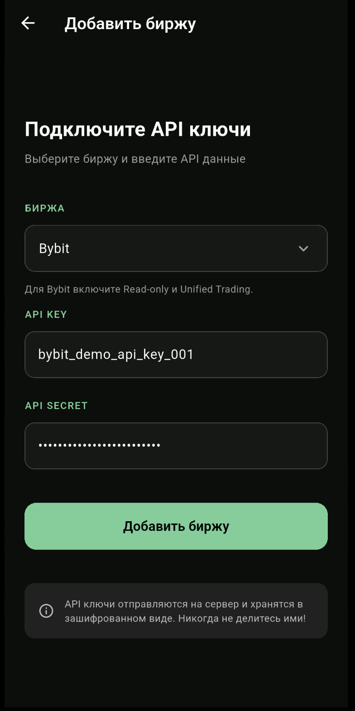
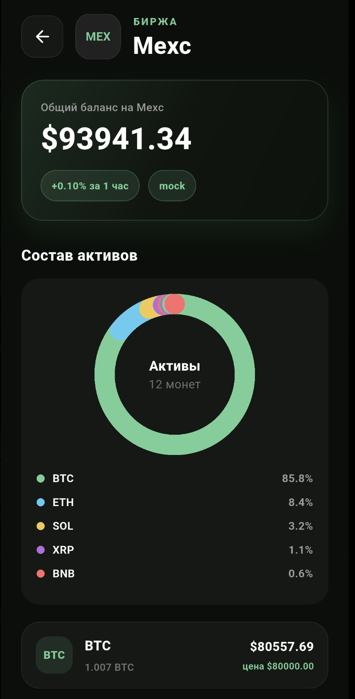
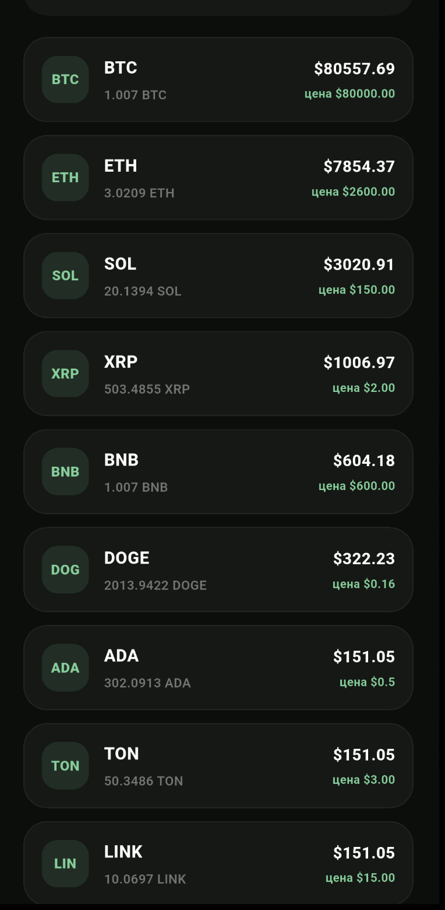

## Cryptofund – кроссплатформенное приложение для агрегации и аналитики криптовалютных портфелей.
Проект решает проблему фрагментации данных трейдеров, объединяя балансы с нескольких бирж (Binance, Bybit, Bitget, Gat, MEXC) в едином интерфейсе с автоматической синхронизацией и визуализацией структуры активов.

####  Приложение разработано с акцентом на безопасность, производительность и чистую архитектуру:
- Бэкенд (Go) отвечает за асинхронное обновление балансов, шифрование API-ключей, работу с PostgreSQL и предоставление REST API.
- Фронтенд (Flutter) предоставляет отзывчивый UI с графикой, управлением состояния и адаптивной вёрсткой под мобильные устройства.

## Технологический стек:
| Направление | Инструменты                                                                    |
|-------------|--------------------------------------------------------------------------------|
| Backend     | Go 1.21+, pgx/pgxpool, REST API, AES-GCM, sync/context, Docker                 | 
| Frontend    | Flutter, Dart, flutter_bloc (Cubit), http, flutter_secure_storage, CustomPaint | 
| DataBase    | PostgreSQL 15+, индексы, JSON для хранения пар активов                         | 

## Запуск:

1) Клонирование репозитория: `git clone https://github.com/anassstya/cryptofund.git`
2) Переход в папку с проектом: `cd cryptofund`
3) Настройка переменных окружения: `cp .env.example .env`
Обязальено необходимо заполнить .env файл
   - **PostgreSQL**
   
   POSTGRES_USER=cryptofund_dev
   
   POSTGRES_PASSWORD=secure_password_123

   POSTGRES_DB=cryptofund_db

   - **Бэкенд**
   
    JWT_SECRET=минимум_32_случайных_символа_для_подписи_токенов

    MASTER_KEY=ровно_32_символа_для_AES_256_GCM_шифрования

    PORT=8080

    LOG_LEVEL=debug

4) Сборка и запуск контейнеров: `docker compose up -d --build`
5) Запуск фронтенда: `flutter run`
6) В Android Studio запуск через: `flutter run`

## Описание экранов:

### Log in / Register screens
Онбординг пользователя: создание аккаунта, аутентификация, получение JWT-токена и инициализация защищённой сессии. 
Экраны спроектированы как единый поток с мгновенным переключением между режимами входа и регистрации без потери контекста.

(JSON Web Token, используется в проекте для безопасной stateless-аутентификации и авторизации)

<table>
  <tr>
    <td align="center">
      
       
      Экран авторизации
    </td>
    <td align="center">
      
       
      Экран регистрации
    </td>
  </tr>
</table>

### Home screen
Экран предоставляет сводную аналитику портфеля, статус синхронизации и быстрый доступ к детализации каждой биржи.

----
Для обеспечения стабильной локальной разработки, изолированного тестирования и 
безопасных демо-показов в проекте реализована полноценная подсистема моков. Она
заменяет реальные запросы к биржевым API детерминированными, 
но динамичными тестовыми данными, полностью имитирующими поведение production-окружения.

Для добавления демо-бирж необходиом перейти в файл `./backend/tempData.json` и там получить key и secret для каждой биржи.

*Обновление общего баланса происходит каждые три минуты, процент показывает изменения за
последний час. Поэтому при создании нового аккаунта и добавления новых бирж, 
процент изменения будет нулевым. Только по истечении часа процент обновится. Для тестирования
изменения % общего баланса можно войти в ранее созданный аккаунт для тестирования:*

Данные для входа:
- Email:`test11@mail.ru`
- Password: `1234567890`

----

На данный момент Cryptofund полностью поддерживает работу с 4 из 5 запланированных бирж (Gate  в процессе добавления). 

Все интеграции построены на прямых запросах к официальным API провайдеров, используют реальную авторизацию и готовы к использованию.

<table>
  <tr>
    <td align="center">
      
       
      Главный экран до добавления бирж
    </td>
    <td align="center">
      
       
      Список заполненных бирж
    </td>
  </tr>
</table>

### Форма добавления бирж
Экран для добавления новых торговых площадок в портфель. 
Здесь пользователь вводит учетные данные (API-ключи) выбранной биржи, после
проходится проверка прав доступа и сохраняется конфигурация.

*UI/UX особенности:*
- Выпадающий список (Binance, Bybit, Bitget, MEXC). Визуально выделяет выбранную платформу.
- Два поля: API Key (открытый текст) и API Secret (маскированный ввод ••••, obscureText: true).
- Мгновенная проверка на пустоту, длину и формат ключей прямо при вводе (через CustomTextField.validator). Блокировка кнопки отправки при ошибках.
- Кнопка «Добавить» превращается в CircularProgressIndicator во время запроса. При успехе — автоматический возврат на главный экран с обновлением списка.

<table>
  <tr>
    <td align="center">
      
       
      Форма добавления бирж
    </td>
    <td align="center">
      
       
      Форма добавления бирж заполненная
    </td>
  </tr>
</table>

### Детальная информация по бирже
Аналитика выбранной торговой площадки: отображение текущего баланса, динамики за последний час и детальной структуры активов в виде кольцевой диаграммы и расширенного списка.

<table>
  <tr>
    <td align="center">
      
       
       Общий баланс и динамика за 1ч
    </td>
    <td align="center">
      
       
      Распределение активов
    </td>
  </tr>
</table>
